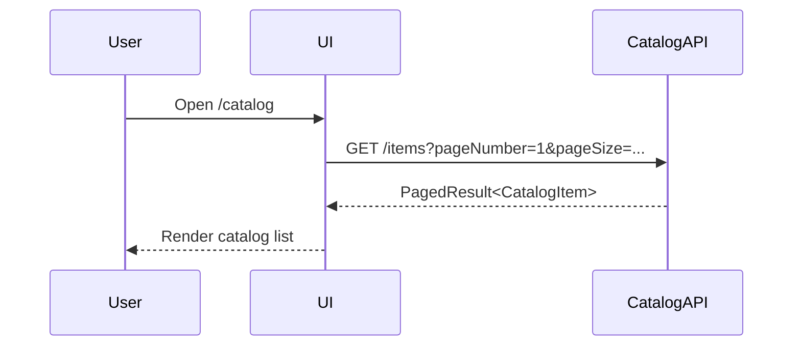
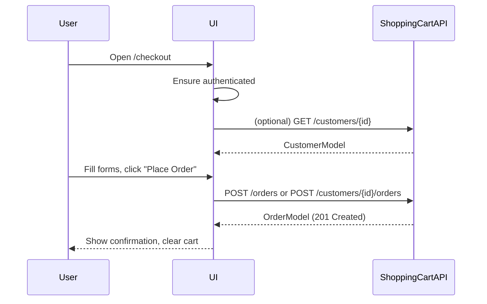
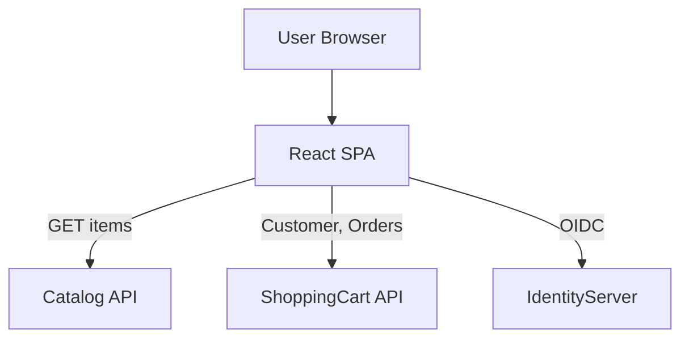

# Document 2 — Technical & Architectural Specification
_Acme Shopping Cart_

## Table of Contents
1. Architecture Overview
2. Application Structure
3. Routing Specification
4. Data Models
5. API Contracts and Usage
6. Authentication & Authorization
7. State Management
8. Error Handling & Validation
9. Performance & Caching
10. Security Considerations
11. Diagrams
12. Environment & Configuration
13. Future Extensions

---

## 1. Architecture Overview

### 1.1 Application Type

- Single Page Application (SPA)
- Built with **React** and **TypeScript**
- Styled with **TailwindCSS**
- Uses **client‑side routing** (e.g., React Router)

### 1.2 External Dependencies

- **IdentityServer** for OpenID Connect–based authentication.
- **Catalog API** for item browsing and details.
- **ShoppingCart API** for customers and orders.

### 1.3 Key Architectural Decisions

- The cart is **client‑side only** until checkout; there is no dedicated “cart” resource in the backend.
- Authentication is required only for:
  - Checkout
  - Order History
  - Profile pages
- Admin/CSR endpoints (e.g., publish customer/order, global customer search) are not used in this SPA.

---

## 2. Application Structure

### 2.1 Suggested Folder Layout

```text
src/
  api/
    catalogApi.ts
    shoppingCartApi.ts
  auth/
    authProvider.tsx
    oidcClient.ts
  components/
    common/
    layout/
  contexts/
    AuthContext.tsx
    CartContext.tsx
  pages/
    Catalog/
    ProductDetail/
    Cart/
    Checkout/
    Orders/
    OrderDetail/
    Profile/
    AuthCallback/
    Login/
  routes/
    AppRoutes.tsx
  types/
    Catalog.ts
    Customer.ts
    Orders.ts
    Cart.ts
    Auth.ts
  utils/
    httpClient.ts
    formatters.ts
```

### 2.2 Component Hierarchy (High‑Level)

- `App`
  - `AuthProvider`
  - `CartProvider`
  - `BrowserRouter`
    - `Layout`
      - `Header` (nav, cart count, auth links)
      - `Main`
        - `AppRoutes`
      - `Footer`

---

## 3. Routing Specification

| Route                       | Description                               | Auth Required |
|-----------------------------|-------------------------------------------|--------------|
| `/`                         | Redirects to `/catalog`                  | No           |
| `/catalog`                  | Catalog list page                        | No           |
| `/product/:sku`             | Product detail page                      | No           |
| `/cart`                     | Cart view/edit                           | No           |
| `/checkout`                 | Checkout flow                            | Yes          |
| `/account/orders`           | Order history                            | Yes          |
| `/account/orders/:orderId`  | Order detail                             | Yes          |
| `/account/profile`          | Profile view/edit                        | Yes          |
| `/login`                    | Initiate OIDC login flow                 | No           |
| `/auth/callback`            | OIDC redirect handler                    | No           |
| `/logout`                   | Local logout (optional remote sign‑out)  | No           |

Protected routes should be wrapped in a component (e.g. `RequireAuth`) that checks `AuthContext`.

---

## 4. Data Models

### 4.1 Catalog Models

```ts
export interface CatalogItem {
  itemId: string;
  name: string;
  sku: string;
  unitPrice: number;
  imageUrl: string;
  status: string; // e.g. "active"
}

export interface PagedResult<T> {
  totalItems: number;
  pageNumber: number;
  pageSize: number;
  items: T[];
}
```

### 4.2 Customer Models

```ts
export interface Customer {
  customerResourceId: string;
  firstName: string;
  lastName: string;
  email: string;
  createdDate: string;
  lastModifiedDate: string;
}

export interface CustomerInput {
  firstName: string;
  lastName: string;
  email: string;
  birthDate: string; // ISO 8601 date (YYYY-MM-DD)
}
```

### 4.3 Order Models

```ts
export type OrderStatus = 'created' | 'paid' | 'shipped' | 'cancelled';

export interface Address {
  street: string;
  city: string;
  state: string;
  country: string;
  zipCode: string;
}

export interface OrderItem {
  orderItemId: number;
  itemId: string;
  sku: string;
  quantity: number;
  unitPrice: number;
}

export interface Order {
  orderResourceId: string;
  status: OrderStatus;
  customer: Customer;
  address: Address;
  items: OrderItem[];
  createdDate: string;
  lastModifiedDate: string;
}
```

### 4.4 Cart Models (Local State)

```ts
export interface CartItem {
  itemId: string;
  sku: string;
  name: string;
  unitPrice: number;
  imageUrl: string;
  quantity: number;
}

export interface CartState {
  items: CartItem[];
}
```

### 4.5 Auth Models

```ts
export interface AuthUser {
  sub: string;
  name?: string;
  email?: string;
}

export interface AuthState {
  isAuthenticated: boolean;
  accessToken: string | null;
  idToken: string | null;
  user: AuthUser | null;
  customerResourceId?: string | null;
}
```

---

## 5. API Contracts and Usage

### 5.1 Catalog API

**Base URL:** `API_CATALOG_BASE_URL` (e.g. `https://mockserver.cortside.net/api/v1`)

#### 5.1.1 List Items

- **Endpoint:** `GET /items`
- **Query Parameters (expected):**
  - `pageNumber`: integer
  - `pageSize`: integer
  - `search`: string (search by name or SKU)
  - `sort`: string (e.g. `name`, `name desc`, `unitPrice`, `unitPrice desc`)

**Response Example:**

```json
{
  "totalItems": 15,
  "pageNumber": 1,
  "pageSize": 15,
  "items": [
    {
      "itemId": "1ed35ab5-0055-4da2-b6fc-8721d136babf",
      "name": "Pappy Van Winkle 10 Year",
      "sku": "pappy-10",
      "unitPrice": 999.99,
      "imageUrl": "https://...jpeg",
      "status": "active"
    }
  ]
}
```

#### 5.1.2 Get Item by SKU

- **Endpoint:** `GET /items/{sku}`

**Response Example:**

```json
{
  "itemId": "1ed35ab5-0055-4da2-b6fc-8721d136babf",
  "name": "Pappy Van Winkle 10 Year",
  "sku": "pappy-10",
  "unitPrice": 999.99,
  "imageUrl": "https://...jpeg",
  "status": "active"
}
```

Catalog API calls do **not** require authentication.

---

### 5.2 ShoppingCart API

**Base URL:** `API_SHOPPINGCART_BASE_URL` (e.g. `https://shoppingcartapi.cortside.net/api`)

All calls require `Authorization: Bearer {accessToken}`.

#### 5.2.1 Customers

**Create Customer**

- **Endpoint:** `POST /v1/customers`
- **Body:** `UpdateCustomerModel` shape:

```json
{
  "firstName": "John",
  "lastName": "Doe",
  "email": "john@example.com",
  "birthDate": "1980-01-01"
}
```

- **Response:** `CustomerModel`

**Get Customer**

- **Endpoint:** `GET /v1/customers/{id}`

**Update Customer**

- **Endpoint:** `PUT /v1/customers/{id}`
- **Body:** same as Create.

#### 5.2.2 Orders

**Create Order for New Customer**

- **Endpoint:** `POST /v1/orders`
- **Body:**

```json
{
  "customer": {
    "firstName": "John",
    "lastName": "Doe",
    "email": "john@example.com",
    "birthDate": "1980-01-01"
  },
  "address": {
    "street": "123 Main St",
    "city": "Denver",
    "state": "CO",
    "country": "USA",
    "zipCode": "80014"
  },
  "items": [
    { "sku": "pappy-10", "quantity": 1 }
  ]
}
```

**Create Order for Existing Customer**

- **Endpoint:** `POST /v1/customers/{resourceId}/orders`
- **Body:**

```json
{
  "address": {
    "street": "123 Main St",
    "city": "Denver",
    "state": "CO",
    "country": "USA",
    "zipCode": "80014"
  },
  "items": [
    { "sku": "pappy-10", "quantity": 1 }
  ]
}
```

**List Orders for Customer**

- **Endpoint:** `GET /v1/orders`
- **Query Parameters:**
  - `CustomerResourceId`: UUID
  - `PageNumber`, `PageSize`, `Sort`

**Get Order Detail**

- **Endpoint:** `GET /v1/orders/{id}`

---

## 6. Authentication & Authorization

### 6.1 OpenID Connect Flow

- Flow: **Implicit flow** with IdentityServer.
- SPA responsibilities:
  - Redirect user to IdentityServer’s `/authorize` endpoint.
  - Handle redirect on `/auth/callback` and extract `id_token` and `access_token` from the URL fragment.
  - Parse claims (e.g. `sub`, `name`, `email`).
  - Store tokens in memory (and optionally local/session storage).

### 6.2 Protected Routes

- `RequireAuth` wrapper:
  - If `AuthContext.isAuthenticated === false`, redirect to `/login`.
  - After login, redirect back to the originally requested route.

### 6.3 Customer Mapping

- Environment must provide a mapping between the OIDC subject (`sub`) and a `customerResourceId`, or the SPA must create a customer on first checkout and remember the resulting `customerResourceId` in `AuthState`.

---

## 7. State Management

### 7.1 AuthContext

- Holds `AuthState`
- Exposes:
  - `login()` → triggers OIDC login
  - `logout()` → clears tokens
  - `setCustomerResourceId(id: string)` → stores customer id after profile/checkout

### 7.2 CartContext

- Holds `CartState`
- Exposes:
  - `addItem(item: CatalogItem, qty: number)`
  - `updateQuantity(sku: string, qty: number)`
  - `removeItem(sku: string)`
  - `clearCart()`
- Derived values:
  - `itemCount`
  - `subtotal`

---

## 8. Error Handling & Validation

### 8.1 HTTP Errors

Use a unified `httpClient` wrapper:

- On `4xx` with validation payload:
  - Map `ErrorsModel.errors` to form fields.
- On `401` for protected routes:
  - Trigger re‑login or redirect to login.
- On `5xx`:
  - Show generic error and optionally retry.

### 8.2 Validation Rules (Client‑Side)

- Required fields:
  - Checkout customer info: firstName, lastName, email, birthDate
  - Address: street, city, state, country, zipCode
- Email format basic check.
- Birthdate format `YYYY‑MM‑DD`.

---

## 9. Performance & Caching

- Use pagination parameters to avoid loading entire catalogs at once.
- Optionally cache:
  - Recently viewed items
  - Last catalog page results and reuse when returning to catalog.

---

## 10. Security Considerations

- Tokens:
  - Prefer in‑memory storage for `accessToken` to minimize XSS risk.
- Ensure no protected API calls are made without a token.
- Do not expose any admin‑only functionality or endpoints in the UI.

---

## 11. Diagrams

### 11.1 Catalog Browse Sequence



### 11.2 Checkout Sequence



### 11.3 High‑Level Architecture



---

## 12. Environment & Configuration

Environment variables (or equivalent):

- `API_CATALOG_BASE_URL`
- `API_SHOPPINGCART_BASE_URL`
- `IDENTITY_AUTHORITY`
- `IDENTITY_CLIENT_ID`
- `IDENTITY_SCOPE` (covers both APIs)
- `REDIRECT_URI` (e.g. `/auth/callback`)
- `POST_LOGOUT_REDIRECT_URI` (e.g. `/`)

---

## 13. Future Extensions

- Add admin dashboards for orders/customers.
- Integrate payment gateway and update order status to `paid`.
- Add richer filtering and faceting to catalog.
- Add role‑based UI based on `/v1/authorization` permissions.

