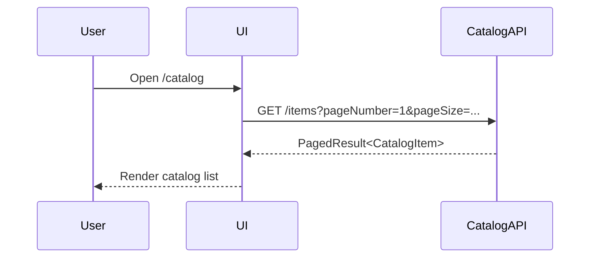
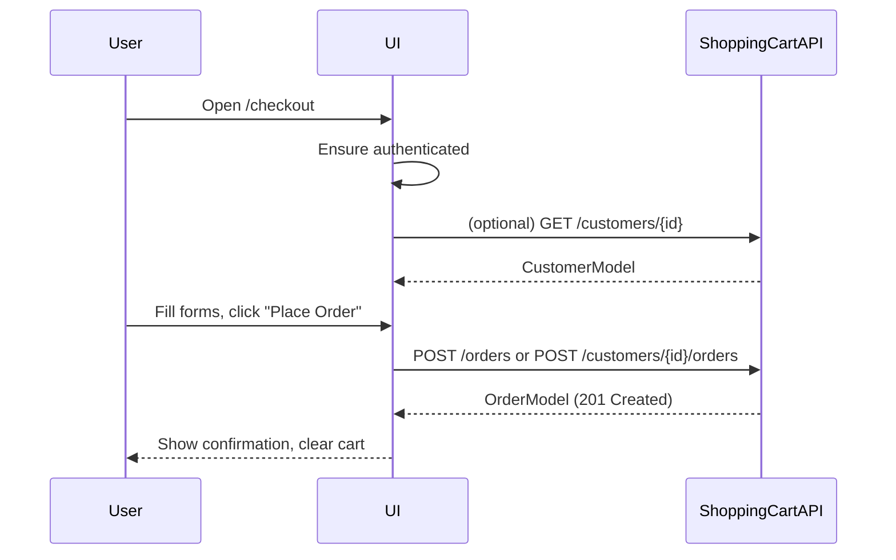
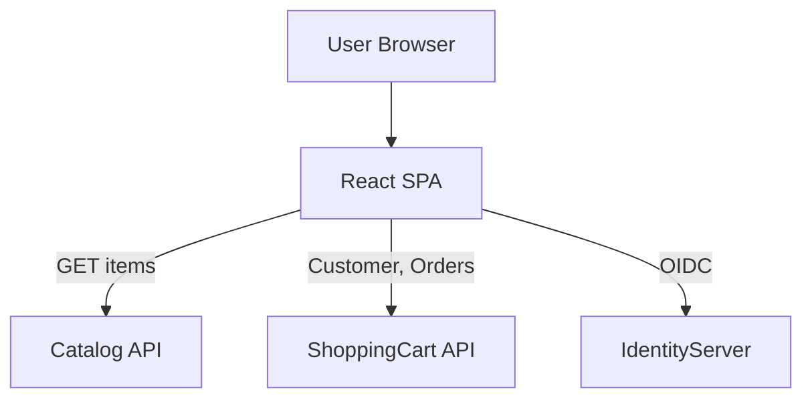
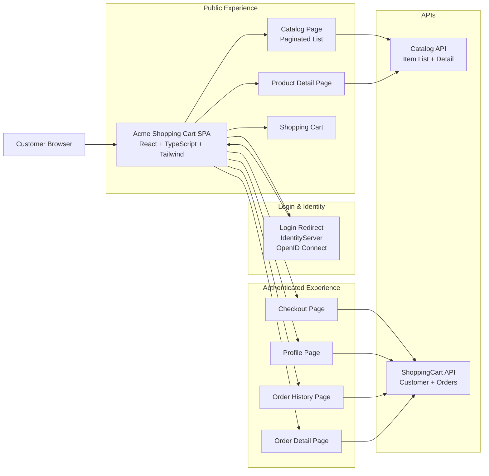

# Technical & Architectural Specification

## Table of Contents
1. Architecture Overview
2. Application Structure
3. Routing Specification
4. Data Models
5. API Contracts and Usage
6. Authentication & Authorization
7. State Management
8. Error Handling & Validation
9. Performance & Caching
10. Security Considerations
11. Diagrams
12. Environment & Configuration
13. Future Extensions
14. Common Issues and Troubleshooting

---

## 1. Architecture Overview

### 1.1 Technology Stack

- **Frontend Framework:** React with TypeScript
- **Styling:** TailwindCSS
- **Routing:** Client-side routing (React Router)
- **Authentication:** OpenID Connect (OIDC)
- **Testing:**
  - Unit Testing: Jest or Vitest
  - E2E Testing: Cypress or Playwright
  - Code Quality: ESLint, Prettier

### 1.2 External Service Dependencies

The application integrates with three external services:

- **IdentityServer** - OpenID Connect authentication provider
- **Catalog API** - Product catalog and search
- **ShoppingCart API** - Customer and order management

For high-level feature descriptions, see [Overview.md](./Overview.md).

### 1.3 Key Architectural Decisions

**Decision: Client-Side Cart Storage**
- **Rationale:** The shopping cart exists only in browser memory/localStorage until checkout. There is no dedicated "cart" resource in the backend APIs.
- **Impact:** Cart data is lost on browser close unless persisted to localStorage. Cart is submitted as part of order creation during checkout.

**Decision: Authentication Gating**
- **Rationale:** To minimize friction, authentication is deferred until necessary.
- **Protected Routes:** Checkout, Order History, Profile pages require authentication.
- **Public Routes:** Catalog browsing, product detail, and cart management are accessible without login.

**Decision: No Admin/CSR Features**
- **Rationale:** This SPA is customer-facing only. Admin endpoints (publish customer/order, global search) exist in ShoppingCart API but are not exposed in this UI.

---

## 2. Application Structure

### 2.1 Suggested Folder Layout

```text
src/
  api/
    catalogApi.ts
    shoppingCartApi.ts
  auth/
    authProvider.tsx
    oidcClient.ts
  components/
    common/
    layout/
  hooks/
    useAuth.ts
    useCart.ts
  contexts/
    AuthContext.tsx
    CartContext.tsx
  pages/
    Catalog/
    ProductDetail/
    Cart/
    Checkout/
    Orders/
    OrderDetail/
    Profile/
    AuthCallback/
    Login/
  routes/
    AppRoutes.tsx
  types/
    Catalog.ts
    Customer.ts
    Orders.ts
    Cart.ts
    Auth.ts
  utils/
    httpClient.ts
    formatters.ts
```

### 2.2 Component Hierarchy (High‑Level)

- `App`
  - `AuthProvider`
  - `CartProvider`
  - `BrowserRouter`
    - `Layout`
      - `Header` (nav, cart count, auth links)
      - `Main`
        - `AppRoutes`
      - `Footer`

    ### 2.3 Section-to-File Mapping (Implementation Guide)

    The following table maps this specification to concrete implementation files, to support planning and code generation:

    | Spec Section                          | Responsibility                                   | Suggested File(s)                           |
    |---------------------------------------|--------------------------------------------------|---------------------------------------------|
    | 3. Routing Specification              | Route configuration & auth gating                | `src/routes/AppRoutes.tsx`, `src/auth/RequireAuth.tsx` |
    | 4. Data Models                        | Shared domain types                              | `src/types/Catalog.ts`, `src/types/Customer.ts`, `src/types/Orders.ts`, `src/types/Cart.ts`, `src/types/Auth.ts` |
    | 5.1 Catalog API                       | Catalog HTTP client                              | `src/api/catalogApi.ts`                     |
    | 5.2 ShoppingCart API                  | Customer & order HTTP client                     | `src/api/shoppingCartApi.ts`                |
    | 6. Authentication & Authorization     | OIDC integration & auth flow                     | `src/auth/oidcClient.ts`, `src/auth/authProvider.tsx` |
    | 6.2 Protected Routes                  | Route protection wrapper                         | `src/auth/RequireAuth.tsx`                  |
    | 6.3 Customer Mapping                  | Managing `customerResourceId` in auth state      | `src/contexts/AuthContext.tsx`              |
    | 7.1 AuthContext                       | Auth state & actions                             | `src/contexts/AuthContext.tsx`              |
    | 7.2–7.3 CartContext & persistence    | Cart state, derived values, and localStorage     | `src/contexts/CartContext.tsx`, `src/utils/storage.ts` |
    | 8. Error Handling & Validation        | HTTP client wrapper & form validation mapping    | `src/utils/httpClient.ts`, `src/utils/validation.ts` |
    | 9. Performance & Caching              | Client-side caching utilities (optional)         | `src/utils/cache.ts`                        |
    | 12. Environment & Configuration       | Runtime configuration loading                     | `src/utils/config.ts`                        |

    These mappings are recommendations and can be adjusted as needed, but they provide a direct bridge from documentation to concrete implementation files.

---

## 3. Routing Specification

| Route                       | Description                               | Auth Required |
|-----------------------------|-------------------------------------------|--------------|
| `/`                         | Redirects to `/catalog`                  | No           |
| `/catalog`                  | Catalog list page                        | No           |
| `/product/:sku`             | Product detail page                      | No           |
| `/cart`                     | Cart view/edit                           | No           |
| `/checkout`                 | Checkout flow                            | Yes          |
| `/account/orders`           | Order history                            | Yes          |
| `/account/orders/:orderId`  | Order detail                             | Yes          |
| `/account/profile`          | Profile view/edit                        | Yes          |
| `/login`                    | Initiate OIDC login flow                 | No           |
| `/auth/callback`            | OIDC redirect handler                    | No           |
| `/logout`                   | Local logout (optional remote sign‑out)  | No           |

Protected routes should be wrapped in a component (e.g. `RequireAuth`) that checks `AuthContext`.

---

## 4. Data Models

### 4.1 Catalog Models

```ts
export interface CatalogItem {
  itemId: string;
  name: string;
  sku: string;
  unitPrice: number;
  imageUrl: string;
  status: string; // e.g. "active"
}

export interface PagedResult<T> {
  totalItems: number;
  pageNumber: number;
  pageSize: number;
  items: T[];
}
```

### 4.2 Customer Models

```ts
export interface Customer {
  customerResourceId: string;
  firstName: string;
  lastName: string;
  email: string;
  createdDate: string;
  lastModifiedDate: string;
}

export interface CustomerInput {
  firstName: string;
  lastName: string;
  email: string;
  birthDate: string; // ISO 8601 date (YYYY-MM-DD)
}
```

### 4.3 Order Models

```ts
export type OrderStatus = 'created' | 'paid' | 'shipped' | 'cancelled';

export interface Address {
  street: string;
  city: string;
  state: string;
  country: string;
  zipCode: string;
}

export interface OrderItem {
  orderItemId: number;
  itemId: string;
  sku: string;
  quantity: number;
  unitPrice: number;
}

export interface Order {
  orderResourceId: string;
  status: OrderStatus;
  customer: Customer;
  address: Address;
  items: OrderItem[];
  createdDate: string;
  lastModifiedDate: string;
}
```

### 4.4 Cart Models (Local State)

```ts
export interface CartItem {
  itemId: string;
  sku: string;
  name: string;
  unitPrice: number;
  imageUrl: string;
  quantity: number;
}

export interface CartState {
  items: CartItem[];
}
```

### 4.5 Auth Models

```ts
export interface AuthUser {
  sub: string;
  name?: string;
  email?: string;
}

export interface AuthState {
  isAuthenticated: boolean;
  accessToken: string | null;
  idToken: string | null;
  user: AuthUser | null;
  customerResourceId?: string | null;
}
```

---

## 5. API Contracts and Usage

### 5.1 Catalog API

**Base URL:** `API_CATALOG_BASE_URL` (e.g. `https://mockserver.cortside.net/api/v1`)

#### 5.1.1 List Items

- **Endpoint:** `GET /items`
- **Query Parameters (expected):**
  - `pageNumber`: integer
  - `pageSize`: integer
  - `search`: string (search by name or SKU)
  - `sort`: string (e.g. `name`, `name desc`, `unitPrice`, `unitPrice desc`)

**Response Example:**

```json
{
  "totalItems": 15,
  "pageNumber": 1,
  "pageSize": 15,
  "items": [
    {
      "itemId": "1ed35ab5-0055-4da2-b6fc-8721d136babf",
      "name": "Pappy Van Winkle 10 Year",
      "sku": "pappy-10",
      "unitPrice": 999.99,
      "imageUrl": "https://...jpeg",
      "status": "active"
    }
  ]
}
```

#### 5.1.2 Get Item by SKU

- **Endpoint:** `GET /items/{sku}`

**Response Example:**

```json
{
  "itemId": "1ed35ab5-0055-4da2-b6fc-8721d136babf",
  "name": "Pappy Van Winkle 10 Year",
  "sku": "pappy-10",
  "unitPrice": 999.99,
  "imageUrl": "https://...jpeg",
  "status": "active"
}
```

Catalog API calls do **not** require authentication.

---

### 5.2 ShoppingCart API

**Base URL:** `API_SHOPPINGCART_BASE_URL` (e.g. `https://shoppingcartapi.cortside.net/api`)

All calls require `Authorization: Bearer {accessToken}`.

#### 5.2.1 Customers

**Create Customer**

- **Endpoint:** `POST /v1/customers`
- **Body:** `UpdateCustomerModel` shape:

```json
{
  "firstName": "John",
  "lastName": "Doe",
  "email": "john@example.com",
  "birthDate": "1980-01-01"
}
```

- **Response:** `CustomerModel`

**Get Customer**

- **Endpoint:** `GET /v1/customers/{id}`

**Update Customer**

- **Endpoint:** `PUT /v1/customers/{id}`
- **Body:** same as Create.

#### 5.2.2 Orders

**Create Order for New Customer**

- **Endpoint:** `POST /v1/orders`
- **Body:**

```json
{
  "customer": {
    "firstName": "John",
    "lastName": "Doe",
    "email": "john@example.com",
    "birthDate": "1980-01-01"
  },
  "address": {
    "street": "123 Main St",
    "city": "Denver",
    "state": "CO",
    "country": "USA",
    "zipCode": "80014"
  },
  "items": [
    { "sku": "pappy-10", "quantity": 1 }
  ]
}
```

**Create Order for Existing Customer**

- **Endpoint:** `POST /v1/customers/{resourceId}/orders`
- **Body:**

```json
{
  "address": {
    "street": "123 Main St",
    "city": "Denver",
    "state": "CO",
    "country": "USA",
    "zipCode": "80014"
  },
  "items": [
    { "sku": "pappy-10", "quantity": 1 }
  ]
}
```

**List Orders for Customer**

- **Endpoint:** `GET /v1/orders`
- **Query Parameters:**
  - `CustomerResourceId`: UUID
  - `PageNumber`, `PageSize`, `Sort`

**Get Order Detail**

- **Endpoint:** `GET /v1/orders/{id}`

---

## 6. Authentication & Authorization

### 6.1 OpenID Connect Flow

- Flow: **Implicit flow** with IdentityServer.
- SPA responsibilities:
  - Redirect user to IdentityServer’s `/authorize` endpoint.
  - Handle redirect on `/auth/callback` and extract `id_token` and `access_token` from the URL fragment.
  - Parse claims (e.g. `sub`, `name`, `email`).
  - Store tokens in memory (and optionally local/session storage).

### 6.2 Protected Routes

- `RequireAuth` wrapper:
  - If `AuthContext.isAuthenticated === false`, redirect to `/login`.
  - After login, redirect back to the originally requested route.

### 6.3 Customer Mapping

- Environment must provide a mapping between the OIDC subject (`sub`) and a `customerResourceId`, or the SPA must create a customer on first checkout and remember the resulting `customerResourceId` in `AuthState`.

### 6.4 Silent Token Renewal

The application SHOULD implement silent token renewal to maintain user sessions without interruption:
- Monitor token expiration
- Refresh tokens before expiration
- Maintain seamless user experience during long sessions

### 6.5 Browser Considerations

**Private/Incognito Mode**: When testing in private browsing mode, users must allow third-party cookies to avoid authentication errors with IdentityServer OIDC flow.

### 6.6 HTTP Token Injection

Implement an HTTP interceptor/middleware that:
- Automatically adds `Authorization: Bearer {accessToken}` header to authenticated requests
- Uses a request context flag (e.g., `requiresAuth` or similar) to identify which requests need tokens
- Handles token refresh before attaching to requests if token is expired

---

## 7. State Management

### 7.1 AuthContext

- Holds `AuthState`
- Exposes:
  - `login()` → triggers OIDC login
  - `logout()` → clears tokens
  - `setCustomerResourceId(id: string)` → stores customer id after profile/checkout

### 7.2 CartContext

- Holds `CartState`
- Exposes:
  - `addItem(item: CatalogItem, qty: number)`
  - `updateQuantity(sku: string, qty: number)`
  - `removeItem(sku: string)`
  - `clearCart()`
- Derived values:
  - `itemCount`
  - `subtotal`

### 7.3 State Persistence

**Cart State Persistence**:
- Cart state SHOULD be persisted to localStorage
- On application load, restore cart from localStorage if available
- Clear localStorage cart after successful order placement
- Consider cart expiration (e.g., 7 days) to avoid stale data

---

## 8. Error Handling & Validation

### 8.1 HTTP Errors

Use a unified `httpClient` wrapper so all API calls share consistent behavior:

- On `4xx` with validation payload:
  - Map `ErrorsModel.errors` to form fields (see 8.3).
- On `401` for protected routes:
  - Trigger re‑login or redirect to login.
- On `5xx`:
  - Show a generic error and optionally retry non-mutating requests.

#### 8.1.1 Suggested `httpClient` Shape

The client MAY be implemented as a thin wrapper around `fetch` or a library like axios. The important behaviors are:

```ts
interface HttpRequestOptions {
  params?: Record<string, string | number | boolean | undefined>;
  body?: unknown;
  requiresAuth?: boolean; // when true, Authorization header MUST be added
}

async function get<TResponse>(url: string, options?: HttpRequestOptions): Promise<TResponse>;

async function post<TBody, TResponse>(
  url: string,
  body: TBody,
  options?: HttpRequestOptions
): Promise<TResponse>;

async function put<TBody, TResponse>(
  url: string,
  body: TBody,
  options?: HttpRequestOptions
): Promise<TResponse>;
```

Token injection behavior is described in section 6.6. All API wrappers in `src/api` SHOULD use this `httpClient` instead of calling `fetch` directly.

### 8.2 Validation Rules (Client‑Side)

- Required fields:
  - Checkout customer info: firstName, lastName, email, birthDate
  - Address: street, city, state, country, zipCode
- Email format basic check.
- Birthdate format `YYYY‑MM‑DD`.

### 8.3 ErrorsModel Shape (Server-Side Validation)

The ShoppingCart API uses `ErrorsModel` for validation and other error responses. From Swagger:

```json
"Cortside.AspNetCore.Common.Models.ErrorModel": {
  "type": "object",
  "properties": {
    "type": { "type": "string", "nullable": true },
    "property": { "type": "string", "nullable": true },
    "message": { "type": "string", "nullable": true },
    "exception": { "nullable": true }
  },
  "additionalProperties": false
},
"Cortside.AspNetCore.Common.Models.ErrorsModel": {
  "type": "object",
  "properties": {
    "errors": {
      "type": "array",
      "items": { "$ref": "#/components/schemas/Cortside.AspNetCore.Common.Models.ErrorModel" },
      "nullable": true
    }
  },
  "additionalProperties": false
}
```

The SPA SHOULD define equivalent TypeScript types, for example:

```ts
export interface ErrorModel {
  type?: string | null;
  property?: string | null;
  message?: string | null;
  exception?: unknown | null;
}

export interface ErrorsModel {
  errors?: ErrorModel[] | null;
}
```

When an API call returns a non-success status with an `ErrorsModel` body, the UI SHOULD:

- Collect all `errors[*].message` into a general error summary, and
- For any `errors[*].property`, map messages to the corresponding form field (e.g., `email`, `birthDate`, `address.street`).

---

## 9. Performance & Caching

- Use pagination parameters to avoid loading entire catalogs at once.
- Optionally cache:
  - Recently viewed items
  - Last catalog page results and reuse when returning to catalog.

---

## 10. Security Considerations

- Tokens:
  - Prefer in‑memory storage for `accessToken` to minimize XSS risk.
- Ensure no protected API calls are made without a token.
- Do not expose any admin‑only functionality or endpoints in the UI.

---

## 11. Diagrams

### 11.1 Catalog Browse Sequence



### 11.2 Checkout Sequence



### 11.3 High‑Level Architecture



### 11.4 High‑Level Architecture (infographic)



---

## 12. Environment & Configuration

### 12.1 Service Endpoints

**Production/Hosted Services** (configured in `public/config.json`):
- **Catalog API**: https://mockserver.cortside.net
- **ShoppingCart API**: https://shoppingcartapi.cortside.net
- **Identity Server**: https://identityserver.cortside.net
- **Dev Server**: http://localhost:5173 (Vite default)

**Local Development Ports** (override in `public/config.local.json`):
- **Catalog API**: http://localhost:5001
- **ShoppingCart API**: http://localhost:5000
- **Identity Server**: http://localhost:5002

### 12.2 Configuration File Strategy

**Configuration Files**:
- `config.json` - Base configuration pointing to hosted services (committed to version control)
- `config.local.json` - Local development overrides (git-ignored, optional)

**Production `config.json`** (committed):

```json
{
  "catalogApi": { "url": "https://mockserver.cortside.net" },
  "shoppingCartApi": { "url": "https://shoppingcartapi.cortside.net" },
  "identity": {
    "authority": "https://identityserver.cortside.net",
    "clientId": "shoppingcart-web",
    "scope": "openid profile shoppingcart-api catalog-api"
  }
}
```

**Local Development `config.local.json`** (git-ignored):

```json
{
  "catalogApi": { "url": "http://localhost:5001" },
  "shoppingCartApi": { "url": "http://localhost:5000" },
  "identity": {
    "authority": "http://localhost:5002",
    "clientId": "shoppingcart-web",
    "scope": "openid profile shoppingcart-api catalog-api"
  }
}
```

### 12.3 Environment Variables

Environment variables (or equivalent):

- `API_CATALOG_BASE_URL`
- `API_SHOPPINGCART_BASE_URL`
- `IDENTITY_AUTHORITY`
- `IDENTITY_CLIENT_ID`
- `IDENTITY_SCOPE` (covers both APIs)
- `REDIRECT_URI` (e.g. `/auth/callback`)
- `POST_LOGOUT_REDIRECT_URI` (e.g. `/`)

---

## 13. Future Extensions

- Add admin dashboards for orders/customers.
- Integrate payment gateway and update order status to `paid`.
- Add richer filtering and faceting to catalog.
- Add role‑based UI based on `/v1/authorization` permissions.

---

## 14. Common Issues and Troubleshooting

### 14.1 Authentication Issues

**Symptom**: Authentication fails in private/incognito browsing mode  
**Solution**: Allow third-party cookies in browser settings for IdentityServer domain

**Symptom**: Token expired errors during active session  
**Solution**: Verify silent token renewal is implemented and functioning correctly

### 14.2 API Connection Issues

**Symptom**: Cannot connect to backend APIs  
**Solution**:
- Verify all services are running on correct ports (Catalog:5001, ShoppingCart:5000, Identity:5002)
- Check CORS configuration on backend services
- Verify API base URLs in configuration files

### 14.3 Configuration Issues

**Symptom**: Application fails to load or shows configuration errors  
**Solution**: Ensure configuration files exist and contain valid JSON with required properties

### 14.4 Development Server Issues

**Symptom**: Dev server port already in use  
**Solution**: Stop other dev servers or configure alternative port in build configuration

